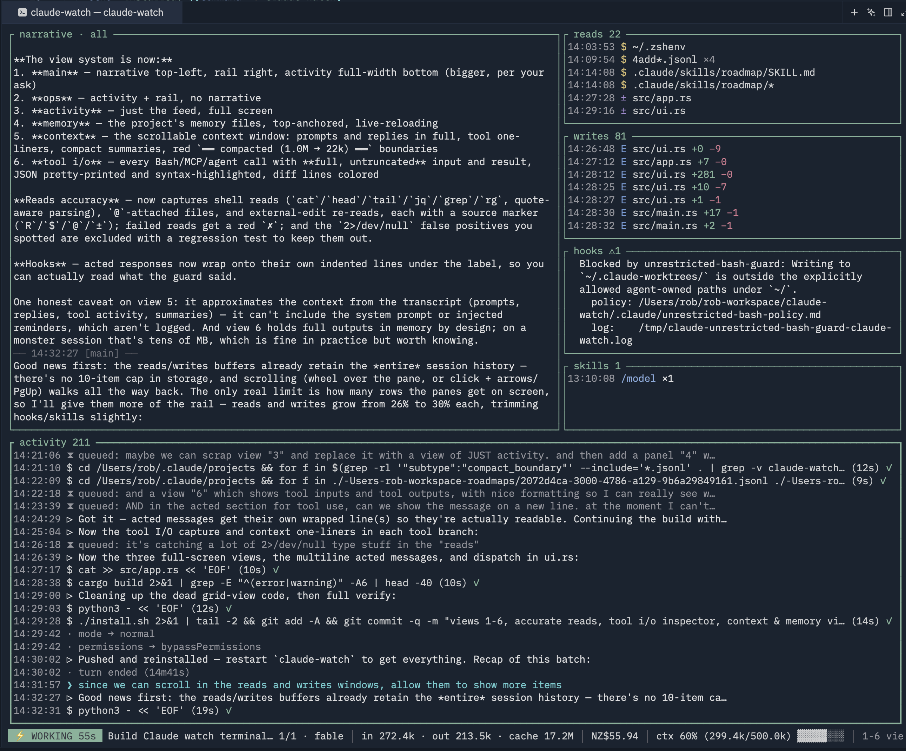
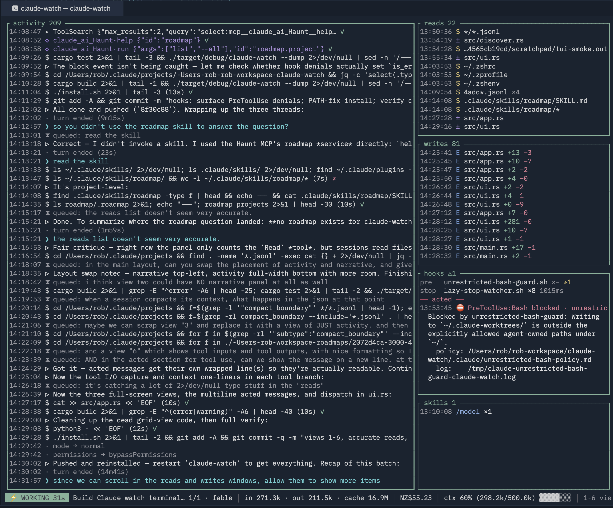
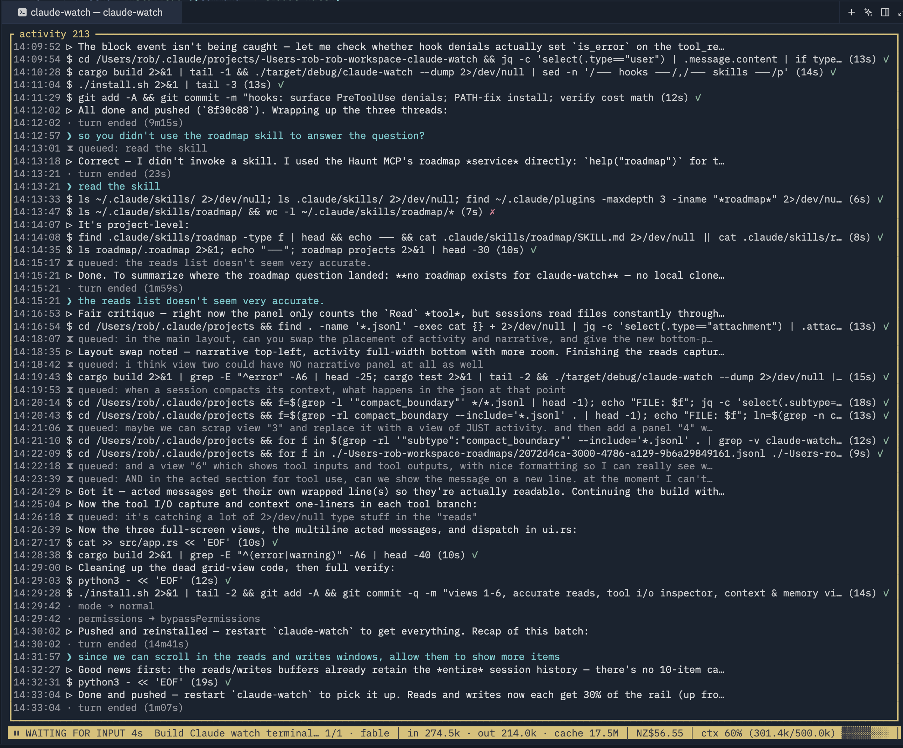
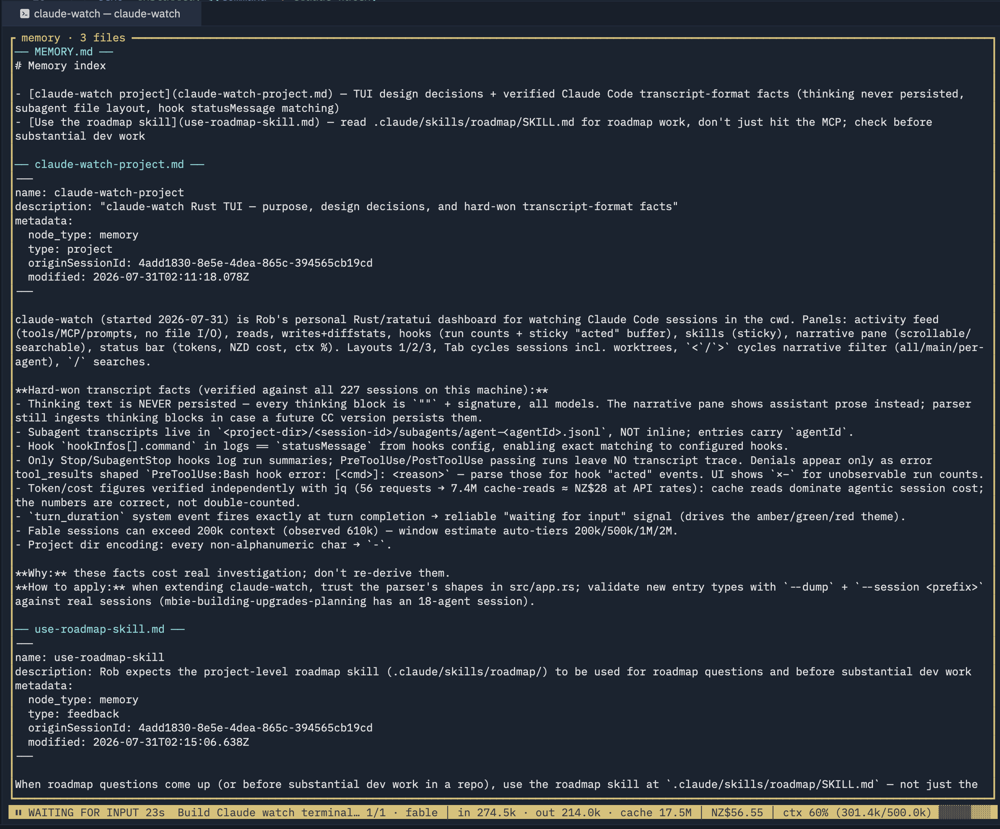
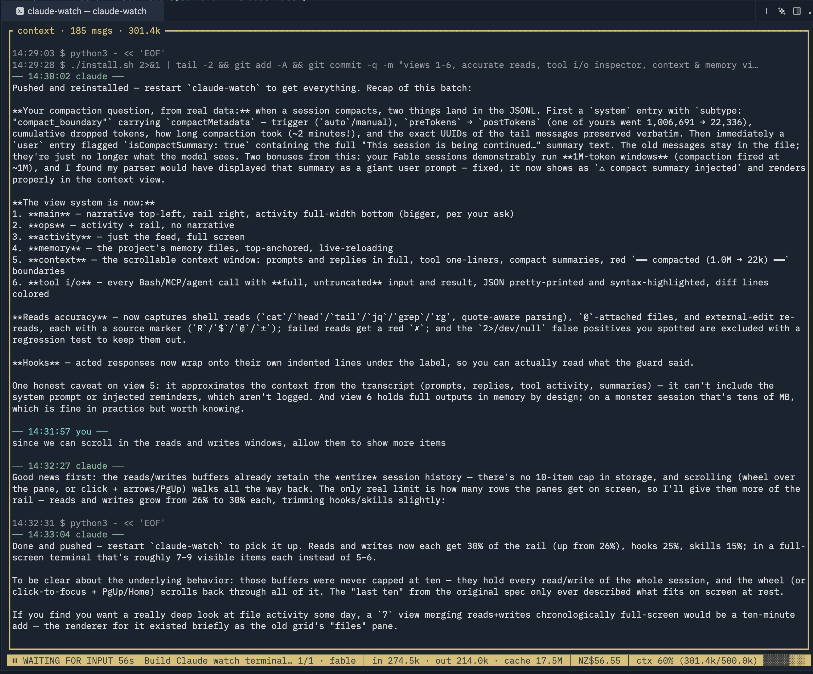
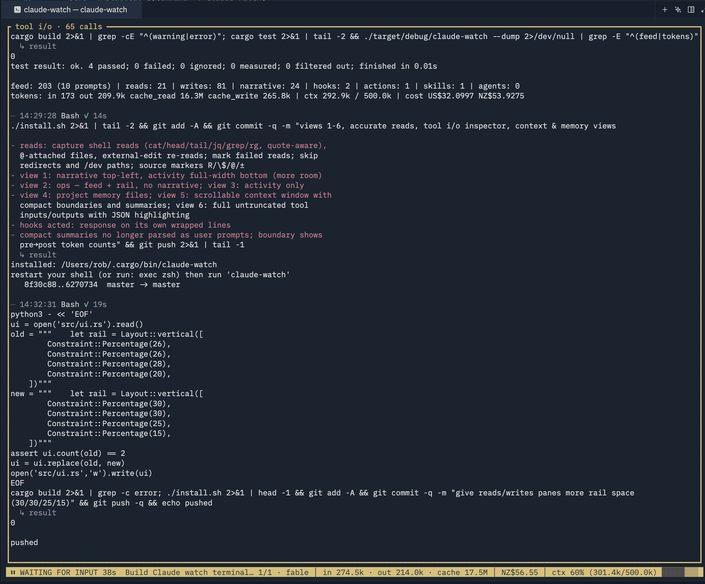

# claude-watch

A live terminal dashboard for [Claude Code](https://claude.com/claude-code) sessions. Run it in any project folder and it tails the most recent session's transcript — including every subagent — and shows you what's actually going on.



## Install

macOS (Apple Silicon), one command — downloads the release binary, clears the quarantine flag, installs to `~/.local/bin`:

```bash
curl -fsSL https://raw.githubusercontent.com/rob-mcgrail/claude-watch/master/install-macos.sh | bash
```

Or from source (needs Rust): `git clone https://github.com/rob-mcgrail/claude-watch && cd claude-watch && ./install.sh`

## Use

```bash
cd some-project        # a folder with a Claude Code session
claude-watch
```

The whole frame changes color with session state: **green** working, **amber** waiting for your input, **red** stalled (usually a permission prompt).

## The six views

Number keys switch views. `1` **main** (above) — narrative pane, reads/writes/hooks/skills rail, full-width activity feed.

`2` **ops** — activity + rail, no narrative:



`3` **activity** — just the feed, full screen (shown here in amber waiting-for-input state):



`4` **memory** — the project's memory files, live-reloading:



`5` **context** — the session's context window as a scrollable document: prompts and replies in full, tool one-liners, compaction boundaries with pre→post token counts, and injected compact summaries:



`6` **tool i/o** — every Bash/MCP/agent call with **full, untruncated** input and result, JSON pretty-printed and highlighted:



## What it shows

- **activity** — chronological feed of prompts, replies, Bash commands, MCP calls, web fetches, and agent spawns, with success/failure markers and durations. Subagent activity is merged in with colored `[sa:model:n]` tags.
- **reads / writes** — file paths as content enters or leaves context. Reads carry a source marker: `R` Read tool, `$` shell command (`cat`/`head`/`tail`/`jq`/`grep`/`rg`, parsed quote-aware), `@` user-attached file, `±` re-read after an external edit. Writes carry `+adds −dels` diffstats. Both scroll back through the whole session.
- **hooks** — every configured hook with run counts and average duration (`×–` where Claude Code doesn't log runs), plus a sticky **acted** buffer for the moments a hook actually intervened — blocked a tool call, blocked a stop, errored, injected context — with the hook's full response.
- **skills** — slash commands and Skill invocations, sticky for the whole session.
- **narrative** — the assistant's full prose, main agent and subagents interleaved, scrollable and searchable, filterable per-agent. (Thinking text is never persisted to disk by Claude Code — every thinking block is stored as an empty string plus signature — so prose is the closest persisted layer. If a future version persists thinking, it will appear here automatically.)
- **status bar** — token totals, session cost in NZD at API rates, and a context-window gauge (window size is estimated per model — Fable sessions observably run 1M — and auto-adjusts if usage exceeds it).

## Keys

| key | action |
|-----|--------|
| `1`–`6` | switch view |
| `Tab` / `Shift-Tab` | cycle sessions for this folder (worktree sessions included) |
| `<` / `>` | narrative filter: all → main → each subagent |
| `/` then `n` / `N` | search the focused pane (activity, narrative, memory, context, tool i/o), jump between matches |
| arrows / PgUp / PgDn / End | scroll focused pane |
| mouse | wheel scrolls the pane under the cursor; click focuses |
| `q` | quit |

Flags: `--nzd-rate 1.72` · `--context-window 500000` · `--session <id-prefix>` · `--dump` (parse and print, no TUI)

## How it works

Claude Code writes session transcripts to `~/.claude/projects/<encoded-cwd>/<session-id>.jsonl`, with subagent transcripts in `<session-id>/subagents/agent-*.jsonl`. claude-watch tails these (plus any git-worktree variants of the cwd), merges entries by timestamp, and derives everything else — no hooks, no wrappers, no interference with the session itself.
